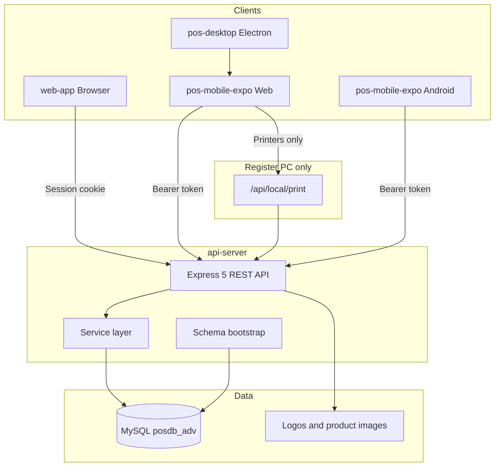

# Architecture Overview

## System purpose

Linda LIM POS supports:

- **Register operations** — barcode sales, cart, checkout, receipts, X/Z readings, voids
- **Back-office administration** — products, stock batches, users, branches, procurement, damage reports, analytics
- **Compliance** — machine/terminal registration (MIN, PTU, OR ranges), audit logs, receipt heading with business profile

The system evolved from a legacy VB.NET WinForms application and retains MySQL schema compatibility (e.g. SHA-256 password hashes, table naming).

## High-level architecture

## Package responsibilities

| Package | Role |
|---------|------|
| **api-server** | Single source of truth for business logic, persistence, auth, file uploads, Windows raw printing |
| **web-app** | Admin UI for configuration, inventory, reporting, user management |
| **pos-mobile-expo** | Shared POS UI — same codebase for Electron web, browser, and Android |
| **pos-desktop** | Packages Expo web build into Electron; optional local API spawn for printers |

## Request paths

### Web admin

1. Browser loads `web-app` (Vite dev or static build).
2. Login → `POST /api/auth/login` → session cookie `linda.sid`.
3. All API calls use `credentials: 'include'` to `/api/*`.
4. `requireAuth` + `requireBranchContext` scope data to the user's branch.

### POS terminal

1. Bootstrap: machine registration, printer selection, login.
2. Login → `POST /api/auth/login` with `X-POS-Client: mobile` → `{ user, token }`.
3. Axios sends `Authorization: Bearer <token>` on POS routes.
4. Business API: hosted URL (`EXPO_PUBLIC_POS_API_URL`) or local fallback.
5. **Printing on Windows:** `POST http://127.0.0.1:5000/api/local/print` only (localhost).

## Schema management

The API does not rely solely on manual SQL dumps. On startup it runs:

- `ensureBranchSchema()` — branches table, `branch_id` on operational tables
- `ensureCheckoutSchema()` — cart, sales_series report columns
- `ensureReceiptHeadingPrintLogoColumns()` / `ensureReceiptHeadingVatModeColumns()`
- Service-level `CREATE TABLE IF NOT EXISTS` for procurement and damage modules

Reference migrations live in `api-server/sql/`. Backups in `db_bak/` are not applied automatically.

## Key design decisions

| Topic | Approach |
|-------|----------|
| Multi-branch | `branch_id` on ~31 tables; users and terminals belong to a branch |
| Stock | FIFO via `product_batches`; cart/checkout decrements batch qty |
| Sales shift | `sales_series` per cashier session; `sales_a` / `sales_b` transactions |
| VAT | Configurable per branch in `receipt_heading` (inclusive/exclusive, rate) |
| Audit | Middleware logs API actions; dedicated audit log viewer in web app |
| POS offline | Not fully offline-first; requires API for catalog, checkout, reports |

## Related documents

- [Multi-branch model](multi-branch.md)
- [Authentication](../authentication.md)
- [API overview](../api/overview.md)
