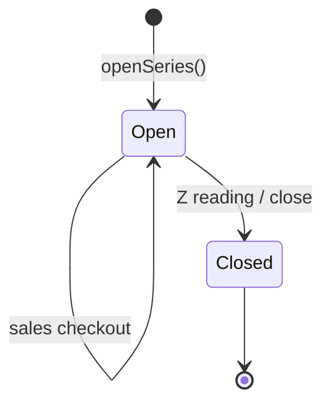

# Database Schema

## Engine and naming

- **MySQL 8.x**, database name typically `posdb_adv`
- Table names reflect legacy VB app (e.g. `sales_a`, `sales_b`, `terminals_a`)
- Bootstrap and migrations in `api-server/db/` and `api-server/sql/`

## Core entity groups

### Organization

| Table | Purpose |
|-------|---------|
| `branches` | Store locations (includes per-branch business profile) |
| `users` | Cashiers and admins (`branch_id`, role, password) |
| `receipt_heading` | Developer/compliance details and receipt print settings per branch |

### Terminals

| Table | Purpose |
|-------|---------|
| `terminals_a` | Machine registration: serial, MIN, PTU, OR range, validity, `branch_id` |

### Products & inventory

| Table | Purpose |
|-------|---------|
| `products` | SKU, barcode, name, price, category |
| `product_category` | Categories per branch |
| `product_batches` | FIFO stock lots (qty, cost, expiry) |
| `product_batches_template` | Batch import templates |
| `product_batches_sync_history` | Sync audit |

### POS sales

| Table | Purpose |
|-------|---------|
| `cart` | Open line items before checkout |
| `sales_series` | Cashier shift: starting balance, OR counter, `lockbatch` |
| `sales_a` | Sale header (OR number, totals, payment, series, machine, user) |
| `sales_b` | Sale line items |

### Damage

| Table | Purpose |
|-------|---------|
| `damage_reports` | Header |
| `damage_report_items` | Lines |
| `damage_reason_options` | Configurable reasons |

### Procurement

| Table | Purpose |
|-------|---------|
| `suppliers` | Vendor master |
| `purchase_requisitions` / `_items` | PR |
| `purchase_orders` / `_items` | PO |
| `goods_receipts` / `_items` | Receiving |
| `supplier_invoices` / `_items` | AP invoices |
| `invoice_match_reviews` | 3-way match |
| `ap_payments` | Payments |

### Audit

| Table | Purpose |
|-------|---------|
| `audit_logs` | API and admin action trail |

## Sales series lifecycle

- **Open:** `sales_series.lockbatch = 'N'`, cashier can sell and run X reading
- **Closed:** `lockbatch = 'Y'` after Z reading; new series required

## Checkout data flow

1. Items in `cart` (per user, machine, branch)
2. `checkout()` creates `sales_a` + `sales_b`, decrements `product_batches`
3. Clears cart; increments OR number on series
4. Returns receipt payload for printing

## Branch column

~31 tables include `branch_id`. See [Multi-branch model](../architecture/multi-branch.md).

## Schema bootstrap

On API startup:

1. `ensureBranchSchema()` — branches + `branch_id` columns and indexes
2. `ensureCheckoutSchema()` — sales report columns
3. Receipt heading column migrations
4. Service `CREATE TABLE IF NOT EXISTS` for newer modules

## Reference SQL

- `api-server/sql/*.sql` — manual migrations
- `db_bak/*.sql` — full or partial dumps for restore

## Important columns (sales_a)

Includes: `or_number`, `total_amount`, `payment_method`, `sales_series_no`, `userid`, `username`, `MachineName`, `branch_id`, VAT fields, timestamps.

## Indexes

Branch-scoped uniqueness and query indexes are added in `ensureBranchSchema.js` (e.g. barcode per branch, audit by branch and date).
