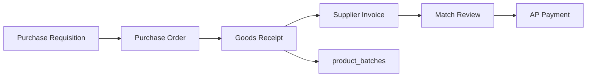

# Procurement Workflow

End-to-end purchasing module in web admin, API under `/api/procurement`.

## Pipeline overview

## Entities

| Stage | Tables | Description |
|-------|--------|-------------|
| Suppliers | `suppliers` | Vendor master per branch |
| PR | `purchase_requisitions`, `_items` | Internal request |
| PO | `purchase_orders`, `_items` | Order to supplier |
| Receiving | `goods_receipts`, `_items` | Stock in; may update batches |
| Invoice | `supplier_invoices`, `_items` | Supplier billing |
| Match | `invoice_match_reviews` | PO vs GR vs invoice |
| Payment | `ap_payments` | Pay supplier |

## Typical workflow

1. **Reorder alerts** — low stock suggestions (`GET /reorder-alerts`)
2. **Create PR** — draft requisition lines
3. **Submit PR** — `POST /requisitions/:id/submit`
4. **Convert to PO** — approved PR → PO
5. **Receive goods** — GR posts quantities; inventory updated
6. **Record invoice** — link to PO/GR
7. **Match review** — resolve quantity/price variances
8. **AP payment** — record payment against invoice

## Status transitions

Each document has status fields (draft, submitted, approved, received, paid, etc.). Exact values are enforced in `procurementService.js`.

## Branch scope

All procurement tables are branch-scoped. Users only see their branch's documents unless admin filters allow broader access.

## Reports

- Requisition report: `GET /requisitions/report`
- List/filter endpoints per entity type

## API entry points

Full route list in [API overview](../api/overview.md) under `/api/procurement`.

## Integration with inventory

Goods receipt flows into `product_batches` (FIFO layers) so received stock is available for POS checkout.
