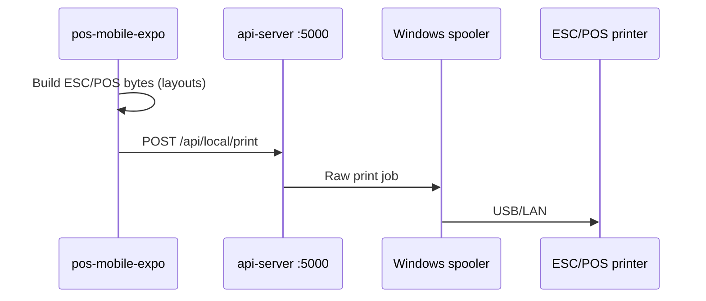

# Printing

Receipt and report printing for POS terminals, primarily on **Windows** register PCs.

## Architecture

- **Business data** (products, checkout) uses hosted or configured API URL.
- **Print jobs** always target `http://127.0.0.1:5000/api/local/print` on web/desktop platform.

## API endpoints

| Method | Path | Body | Description |
|--------|------|------|-------------|
| GET | `/api/local/printers` | — | List installed printer names |
| POST | `/api/local/print` | `{ printerName, data }` | `data` = base64 or raw ESC/POS buffer |

Implemented in `api-server/routes/localPrinters.js`.

## Client code

`pos-mobile-expo/src/services/printer/printerService.ts`:

1. `printReceipt()`, `printXReport()`, `printZReport()` build payload
2. On `web` platform, POST to local API
3. On failure, may **fall back to `console.log`** — failures can appear silent in UI

Layouts:

- `layouts/receiptLayouts.ts` — sale receipt
- `layouts/reportLayouts.ts` — X/Z slips (cashier label, totals, headings)

## Receipt content

Pulled from:

- `receipt_heading` (business name, address, TIN, VAT mode)
- Optional logo if **print logo on receipts** enabled
- Line items, totals, OR number, payment method

## X/Z slips

- Scoped to active sales series (see [POS terminal features](features/pos-terminal.md))
- Label format: `CASHIER:` (cashier name/id)

## Setup checklist (register PC)

1. Install receipt printer; verify in Windows **Devices and Printers**
2. Run API on `127.0.0.1:5000` (Electron may spawn it)
3. In POS printer setup, select exact printer name from list
4. Test checkout print

## Troubleshooting

| Symptom | Likely cause |
|---------|----------------|
| Nothing prints, no error | Local print failed; check console for fallback log |
| Connection refused | API not running on port 5000 |
| Wrong printer | Name mismatch — re-select from `/api/local/printers` |
| Garbled output | Wrong code page or non-ESC/POS printer |
| Works in admin, not POS | `EXPO_PUBLIC_POS_API_URL_LOCAL` wrong |

## Electron / pos-desktop

`pos-desktop` bundles or starts local API so print routes are available. Expo web loads in Electron webview; same print path as browser POS on localhost.

## Android

Printing path differs by device; local Windows API route is not used. Configure per deployment if mobile printing is required.

## Security

`/api/local/*` should only be exposed on localhost on register machines, not on public internet.
